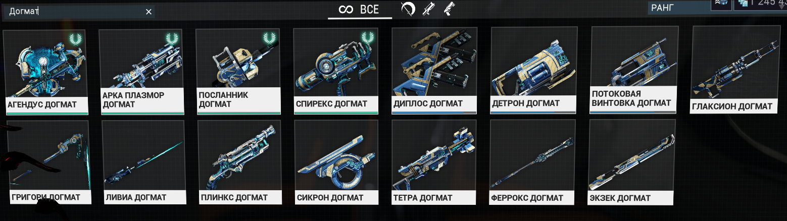

# DZ_June
# First Seminar
* Внести изменения 
* Сохранить изменени (CANTRL+S)
* Добавить с изменениями
* Зафиксировать/закоммитить файл
## git init
Создать репозиторий внутри папки
## git add
Добавить файл или файлы к следующему коммиту
## git status
Проверить состояние репозитория
## git diff
Увидеть разницу между созраненным и зафиксированным файлом
## git log
Показывает историю изменения
## Картинки в тексте
Чтобы добавить картинку в текст необходимо использовать следующий синтаксис - ставим восклицательный знак, потом в квадратных скобках указываем текст, а в круглых - адрес файла с картинкой. Адрес относительный или абсолютный. Например, вот так:

## Списки
Чтобы выделить ненумерованный список, используйсте (*)
## Git branch
Показывает список веток
## Git branch new_branch_name
Эта комнда добавляет новую ветку, вместо "new_branch_name" можно писать любое имя какое хотите.
## Merging branches
Чтобы соединить две ветки, например находясь в основной ветке добавить в нее другую ветку, нужно ввести команду **_git merge_ и написать имя ветки которую хотите присоединить к основной**
## Git graph
ЧТобы отобразить лог в виде дерева изменений, надо ввести команду **git log --graph**

## Instrution for repository
Чтобы сделать локальную копию удаленного репозитория надо ввести команду **git clone** и вставить ссылку с gitHub на удаленный репозиторий
## Git pull
Чтобы стянуть/выкачать все изменения из удаленного репозитория на свой компьютер нужно ввести команду **git pull**